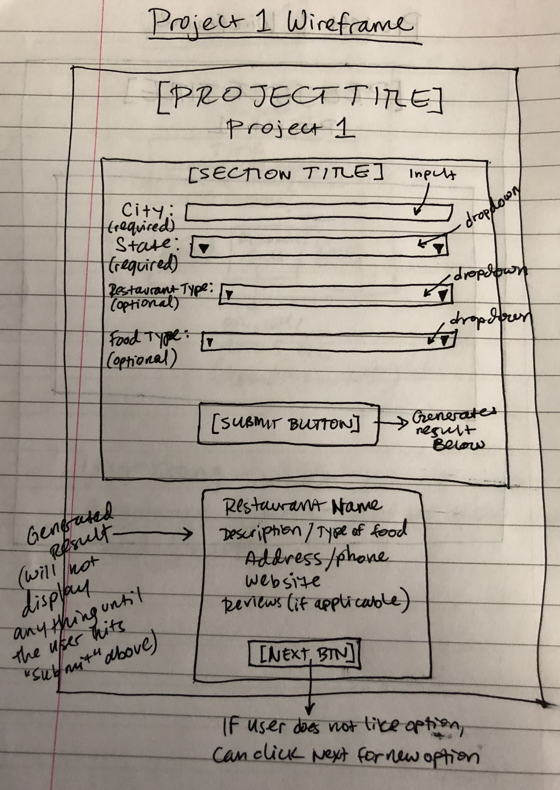

# Project1

## Project Title
Restaurant Randomizer

## Project Description
This application is for the indecisive foodies. It will generate a random restaurant or brewery in the city/state of the user's choosing, using either the Zomato API (for restaurant) or Open Brewery API (for brewery). The user will specify which type of establishment they prefer and will have the option to also specify type of cuisine they want. If that field is left blank, the app will generate a random establishment of any genre. 

Once the user fills in the desired criteria, s/he will hit the "Submit" button and a single restaurant or brewery option will be generated below, with information such as name, description/type of food, address/phone, website, and reviews.

Additionally, underneath the generated option, a "Next" button will appear. If the user does not like the initial option given, s/he can click "Next" and generate a new option. Think Tinder for restaurants/breweries!

## User Story
* AS AN indecisive restaurant/brewery attendee
* I WANT a website or application to choose a restaurant for me in my chosen area with my chosen criteria
* SO THAT I can save time/stress and find a place to eat without having to scroll through many options at once

## Wireframe/sketch

## APIs to be used
* Zomato API 
* Open Brewery API 
* jQuery

## Rough Breakdown of Tasks
* Create and link all initial files
* Set up HTML page
* Set up CSS styling using Bulma
* Research Zomato API, create API key, and use AJAX to pull data
* Research Open Brewery API and use AJAX to pull data (no API key necessary)
* Incorporate AJAX requests into JavaScript event listeners
* Complete JavaScript file to 
